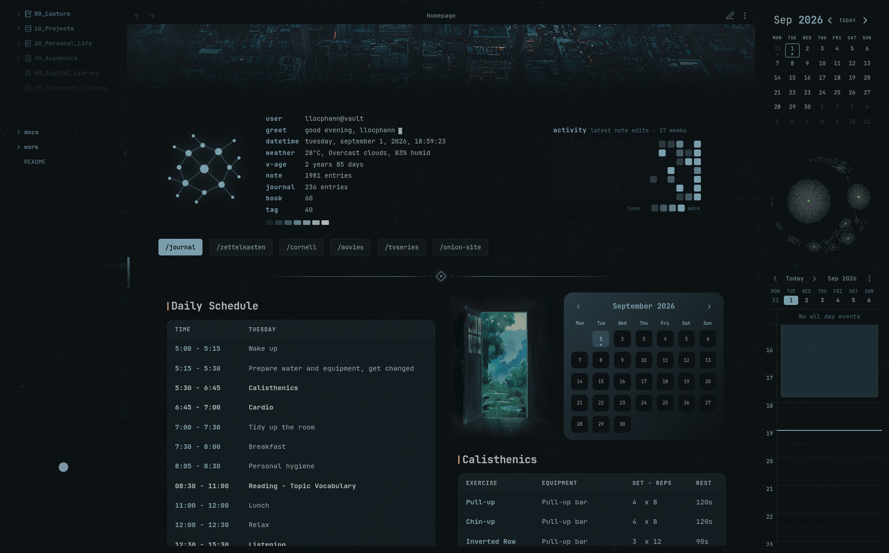

# Veil

Veil places a vault-local image, animated GIF, or video behind the Obsidian workspace. It keeps wallpaper media separate from interface content and can switch complete visual **Scenes** automatically from note context, frontmatter, theme, day, or time.

<p align="center">
  
</p>

<p align="center">
  <sub>The city background in my theme</sub>
</p>

## Features

- Pick an image, animated GIF, or video directly from the current vault.
- Create reusable **Scenes** that bundle wallpaper, pool behavior, framing, opacity, effects, transition, and video behavior, then duplicate a Scene when you want a variation without rebuilding it.
- Route an inline wallpaper or a complete Scene by note name, exact path, folder, tag, or frontmatter property.
- Add adaptive fallback routes for light/dark theme, local time, day of week, or combined schedules.
- Temporarily override all automatic routing with the command-palette **Switch scene** action, then return to **Follow context rules**.
- Build random wallpaper pools from a selected file's folder, optionally including descendant folders, with stable per-context choices and explicit shuffle.
- Browse supported media in a lazy visual Wallpaper Library with search, Favorites, Recently Selected, folder/media filters, sorting, and random selection; apply a choice directly to the default appearance, a Scene, or an inline rule.
- Adjust horizontal/vertical focal point, 100–200% zoom, fill/fit/center/stretch/scale-down sizing, and wallpaper opacity.
- Crossfade safely between wallpapers while retaining the previous media if the incoming file fails to load or navigation changes again before the next wallpaper is ready.
- Adjust pane-surface opacity independently or fade each outer pane and its descendants as one visual group.
- Add elliptical/circular vignette, blur, dim, color overlay, retro film, glitch, or TV-noise effects.
- Apply settings to the main desktop window and Obsidian pop-out windows.
- Pause video in hidden windows and respect the operating system's reduced-motion preference.
- Export/import a validated, versioned JSON backup of portable Veil settings, Scenes, and rules.

Veil is desktop-only because reliable video wallpaper playback and multi-window handling depend on Obsidian's desktop runtime.

## Privacy and file access

Veil reads only vault-local wallpaper media and Obsidian's already-indexed metadata needed by configured rules, including file path, tags, and frontmatter for active notes. It does not make network requests, collect telemetry, run analytics, modify media files, or install updates by itself. Wallpaper paths must remain vault-relative; URLs and paths outside the vault are rejected.

Favorites and Recently Selected are local convenience metadata stored in Veil's `data.json`. They are not embedded in portable settings exports. Selected media always remains in its original vault location.

## Installation

### Community Plugins

After Veil is accepted into the Obsidian Community Plugins directory:

1. Open **Settings → Community plugins → Browse**.
2. Search for **Veil**.
3. Select **Install**, then **Enable**.

### Manual installation

1. Download `main.js`, `manifest.json`, and `styles.css` from the matching GitHub release.
2. Place them in `<vault>/.obsidian/plugins/veil/`.
3. Reload Obsidian and enable **Veil** under Community plugins.

The plugin ID is `veil`, which is also the name of its folder inside `.obsidian/plugins`.

## Usage

Open **Settings → Community plugins → Veil**. The **Wallpaper** tab controls the default appearance; **Rules** contains Scenes, routing, and opacity exclusions.

### Scenes

A Scene stores a complete appearance rather than only a wallpaper path. This includes pool settings, focal point and zoom, display mode, wallpaper/pane opacity, transition duration, vignette, blur/dim, color overlay, effect preset, and video/reduced-motion behavior.

Create a Scene from the current global appearance, customize it, then select that Scene as the appearance source of a wallpaper route. Use **Duplicate scene** to create an independent copy with a new ID and the same complete appearance, which is useful for making variants. Veil accepts up to 64 Scenes. Legacy-style inline routes remain available and intentionally preserve Veil 1.3 semantics: they replace only the media while using the global appearance and do not inherit the global wallpaper pool.

Use **Veil: Switch scene** from the command palette for a session-only manual Scene override. Manual override has the highest priority and is never written into settings; choose **Follow context rules** to resume automatic routing.

### Wallpaper pools and library

Enable **Wallpaper pool** on the default appearance or a Scene to choose randomly from supported media in the selected wallpaper's folder. The chosen item remains stable for that context until the pool is shuffled or that specific appearance's pool anchor/scope changes. Editing opacity, effects, or an unrelated Scene does not reroll the current pool choice. **Include subfolders** extends discovery to descendants.

Use **Wallpaper Library** from Settings or the command palette to browse vault media visually. Image thumbnails load lazily; videos use lightweight placeholders so opening a large library does not start decoding every video. You can search paths, filter by top-level folder or media type, sort by name or modification time, choose randomly from the current filtered results, and select an **Apply to** target for the default appearance, a Scene, or a legacy inline wallpaper rule.

### Routing rules

Ordinary routes can match:

- **Note name** without requiring the `.md` extension;
- **Exact path** to one vault file;
- **Folder** and every descendant note;
- **Tag**, including nested tags such as `#media/movie` when matching `#media`;
- **Property**, using `key=value` for case-insensitive scalar/array matching or only `key` to match frontmatter-property existence.

Examples of frontmatter property rules:

```text
veil=focus
rating=5
published=true
mood=dark
```

Property rules also expose reserved Veil system-context fallbacks:

```text
@theme=dark
@theme=light
@time=22:00-06:00
@day=weekday
@day=weekend
@day=mon,wed,fri
@schedule=mon-fri 08:00-18:00
@schedule=mon-fri 22:00-06:00
```

Time and schedule values use the computer's local time. Overnight ranges are supported. Day names are case-insensitive and accept common short or long English forms.

Within each priority tier, Wallpaper routes are evaluated from top to bottom. Overall wallpaper routing priority is deliberate:

1. a temporary manual Scene override;
2. ordinary note/path/folder/tag/frontmatter wallpaper rules, first match in list order;
3. adaptive `@theme`, `@time`, `@day`, or `@schedule` wallpaper fallbacks, first match in list order;
4. the default appearance.

This means an adaptive rule remains a fallback even if it is visually placed above a note-specific rule. Opacity exclusions are additive: every matching exclusion can independently keep pane surfaces, pane content, or both at full opacity.

### Import and export

Use **Actions → Export settings** to download a portable JSON backup. Import verifies the schema and file size, normalizes values, repairs duplicate IDs, and migrates schema-1 Veil 1.3 exports automatically. Media files, Favorites, Recently Selected, and the session-only manual Scene override are not embedded in exports.

For broad codec support, prefer WebM or MP4 video. Whether a particular MOV, M4V, or OGV file plays depends on the codecs available in the user's Obsidian desktop runtime.

## Performance and stability

Veil is event-driven and does not poll the vault. Repeated workspace refreshes are coalesced into one animation frame, wallpaper pools cache candidate paths, library thumbnails are created only when the library is opened, and video pauses in hidden windows when configured.

Adaptive scheduling also avoids interval polling. Theme changes react to Obsidian's CSS-change event. For `@time`, `@day`, and `@schedule`, Veil computes the next meaningful boundary and keeps a single one-shot timer until that boundary; if no scheduled rule exists, no scheduling timer exists.

Wallpaper transitions use double buffering: the current wallpaper remains visible until the incoming media has successfully loaded. A failed incoming image/video restores the previous working wallpaper instead of leaving a blank background. Rapid navigation also retains the last ready wallpaper while intermediate requested media is still preloading.

Effect cost depends on media size, window resolution, and graphics hardware:

| Feature | Typical cost | Notes |
| --- | --- | --- |
| Opacity, dim, color overlay, vignette | Low | Primarily composited by the GPU. Non-normal overlay blend modes add a small compositing cost. |
| Retro film | Low–moderate | Uses a static media filter and scanline layer. |
| Blur | Moderate–high GPU | Cost rises with blur radius, wallpaper resolution, and number of open windows. |
| Video or animated GIF | Moderate CPU/GPU | Video decoding depends on codec and resolution. GIF animation cannot be paused by Veil. |
| Glitch and TV noise | High GPU | These presets animate continuously. Reduced-motion mode freezes their animation. |
| Video + strong blur + animated preset | Highest | This combination may stutter on integrated graphics or battery-powered devices. |

For the lightest setup, use a static image, keep blur low or off, and avoid animated presets. If animation is needed, keep **Pause video when the app is hidden** and **Respect reduced motion** enabled.

## Support

If Veil is useful to you, you can support its continued development:

[](https://www.buymeacoffee.com/llocphann)

## Development

Requirements: Node.js 20 or newer.

```bash
npm install
npm run dev
```

Run the complete verification suite before publishing:

```bash
npm run check
```

The production build writes `main.js` at the repository root. `main.js` is intentionally excluded from source control and attached to tagged GitHub releases instead.

## Releasing

1. Update the version in `package.json`.
2. Run `npm version patch`, `npm version minor`, or `npm version major` as appropriate.
3. Push the commit and its version tag.
4. The release workflow verifies the tag, runs all checks, attests the release files, and creates a draft GitHub release containing `main.js`, `manifest.json`, and `styles.css`.
5. Review and publish the draft release.

The Git tag must exactly match the version in `manifest.json`.

## License

[GNU General Public License v3.0](LICENSE)